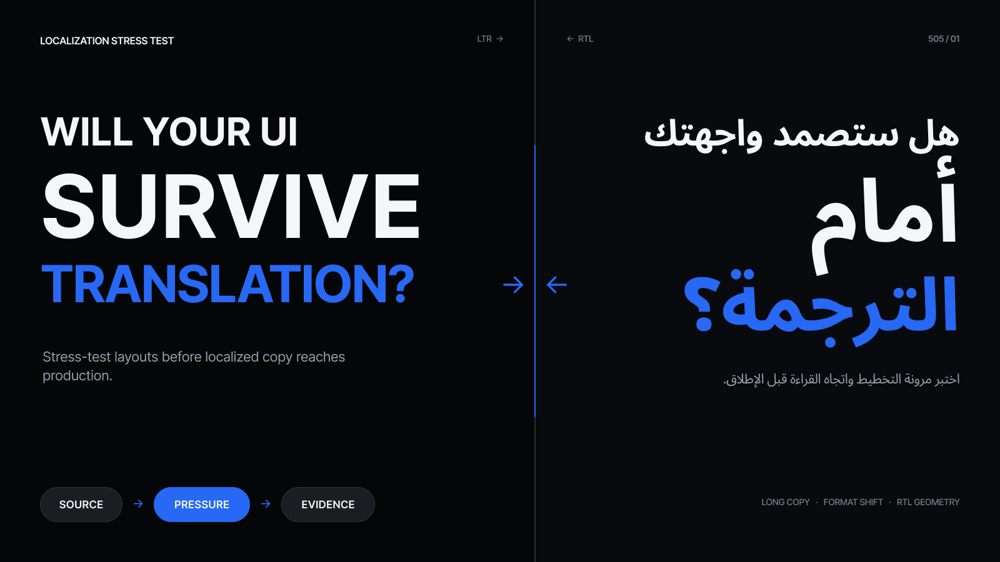

# Localization Stress Test

Stress-test selected Figma screens, components, or flows for localization readiness before approved translations reach production.

The skill preserves the source, creates isolated pressure variants, and produces a reviewable evidence board with stable findings, a coverage matrix, and a prioritized remediation queue.

## What it tests

- Long-copy expansion
- Dense-script line breaking
- RTL reading order and directional semantics
- Locale-specific dates, numbers, currencies, names, addresses, and units
- Pseudolocalized string coverage
- Real locales when approved translations are supplied

Synthetic content is always labeled as stress content and is never presented as a verified translation.

## Install

Copy the `localization-stress-test` folder into the skills directory used by your agent, then invoke `$localization-stress-test` with one or more Figma frames selected.

For Figma Agent, which currently accepts a single Markdown file, upload [`dist/localization-stress-test.figma.md`](dist/localization-stress-test.figma.md).

## Example prompts

- Stress-test these checkout screens for long-copy expansion and RTL geometry. I do not have approved translations yet.
- Check this component set for localization failures at its narrowest supported width.
- Use our approved Japanese copy and show which screens are not ready for linguistic QA.
- Run a quick localization scan on this pricing page, including currencies, dates, and pseudolocalized coverage.

## Requirements

- A host agent that supports Agent Skills
- Read and write access to the target Figma file
- Figma MCP tools for canvas inspection and editing

## License

[MIT](LICENSE)
